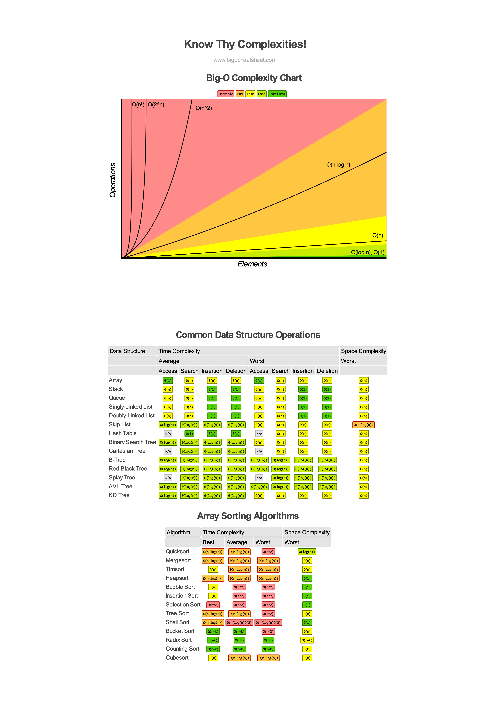

# Leetcode

## Topic

### Stack

- [20. Valid Parentheses](20.valid-parentheses.js)
- [32. Longest Valid Parentheses](32.longest-valid-parentheses/stack.js)
- [71. Simplify Path](71.simplify-path.js)
- [84. Largest Rectangle in Histogram](84.largest-rectangle-in-histogram.js)
- [456. 132 Pattern](456.132-pattern/stack.js)
- [735. Asteroid Collision](735.asteroid-collision.js)
- [856. Score of Parentheses](856.score-of-parentheses/stack.js)
- [946. Validate Stack Sequences](946.validate-stack-sequences.js)
- [1047. Remove All Adjacent Duplicates In String](1047.remove-all-adjacent-duplicates-in-string.js) #string-duplicates
- [1209. Remove All Adjacent Duplicates in String II](1209.remove-all-adjacent-duplicates-in-string-ii.js)
- [1249. Minimum Remove to Make Valid Parentheses](1249.minimum-remove-to-make-valid-parentheses.js)
- [2390. Removing Stars From a String](2390.removing-stars-from-a-string.js)

#### [Monotonic Stack](./monotonic-stack/README.md)

- [496. Next Greater Element I](496.next-greater-element-i.js)
- [503. Next Greater Element II](503.next-greater-element-ii.js)
- [581. Shortest Unsorted Continuous Subarray](581.shortest-unsorted-continuous-subarray/monotonic-stack.js)
- [739. Daily Temperatures](739.daily-temperatures/monotonic-stack.js)
- [907. Sum of Subarray Minimums](907.sum-of-subarray-minimums.js)
- [1475. Final Prices With a Special Discount in a Shop](1475.final-prices-with-a-special-discount-in-a-shop.js)
- [1673. Find the Most Competitive Subsequence](1673.find-the-most-competitive-subsequence.js)

### Hash Table

- [36. Valid Sudoku](36.valid-sudoku.js)
- [141. Linked List Cycle](141.linked-list-cycle/hash-table.js)
- [205. Isomorphic Strings](205.isomorphic-strings.js)
- [532. K-diff Pairs in an Array](532.k-diff-pairs-in-an-array/hash-table.js)
- [1436. Destination City](1436.destination-city.js)
- [1679. Max Number of K-Sum Pairs](1679.max-number-of-k-sum-pairs/hashmap-single-pass.js)

### Backtracking

- [17. Letter Combinations of a Phone Number](17.letter-combinations-of-a-phone-number.js)
- [39. Combination Sum](39.combination-sum.js)
- [40. Combination Sum II](40.combination-sum-ii.js)
- [216. Combination Sum III](216.combination-sum-iii.js)
- [46. Permutations](46.permutations.js)
- [47. Permutations II](47.permutations-ii.js)
- [77. Combinations](77.combinations.js)
- [78. Subsets](78.subsets.js)
- [90. Subsets II](90.subsets-ii.js)
- [1641. Count Sorted Vowel Strings](1641.count-sorted-vowel-strings/backtracking.js)

### Two Pointers

- [11. Container With Most Water](11.container-with-most-water.js)
- [32. Longest Valid Parentheses](32.longest-valid-parentheses/two-pointers.js) 👍
- [42. Trapping Rain Water](42.trapping-rain-water/two-pointers.js) 👍
- [75. Sort Colors](75.sort-colors.js)
- [283. Move Zeroes](283.move-zeroes.js)
- [344. Reverse String](344.reverse-string.js)
- [532. K-diff Pairs in an Array](532.k-diff-pairs-in-an-array/two-pointers.js) 👍
- [680. Valid Palindrome II](680.valid-palindrome-ii.js)
- [905. Sort Array By Parity](905.sort-array-by-parity.js)
- [844. Backspace String Compare](844.backspace-string-compare/two-pointer.js)
- [881. Boats to Save People](881.boats-to-save-people.js)
- [1055. Shortest Way to Form String](1055.shortest-way-to-form-string.js)

### Dynamic Programming

- [5. Longest Palindromic Substring](5.longest-palindromic-substring/dynamic-programming.js)
- [42. Trapping Rain Water](42.trapping-rain-water/dynamic-programming.js)
- [62. Unique Paths](62.unique-paths.js)
- [63. Unique Paths II](63.unique-paths-ii.js)
- [64. Minimum Path Sum](64.minimum-path-sum.js)
- [121. Best Time to Buy and Sell Stock](121.best-time-to-buy-and-sell-stock.js)
- [139. Word Break](139.word-break/bottom-up-dp.js)
- [198. House Robber](198.house-robber/dynamic-programming.js)
- [213. House Robber II](213.house-robber-ii.js)
- [239. Sliding Window Maximum](239.sliding-window-maximum.js)
- [256. Paint House](256.paint-house.js)
- [265. Paint House II](265.paint-house-ii.js)
- [300. Longest Increasing Subsequence](300.longest-increasing-subsequence/dynamic-programming.js)
- [322. Coin Change](322.coin-change.js)
- [403. Frog Jump](403.frog-jump.js)
- [486. Predict the Winner](486.predict-the-winner.js)
- [516. Longest Palindromic Subsequence](516.longest-palindromic-subsequence.js)
- [518. Coin Change 2](518.coin-change-2.js)
- [542. 01 Matrix](542.01-matrix/dynamic-programming.js)
- [629. K Inverse Pairs Array](629.k-inverse-pairs-array/dynamic-programming.js)
- [646 Maximum Length of Pair Chain](646.maximum-length-of-pair-chain.js)
- [647. Palindromic Substrings](647.palindromic-substrings/dynamic-programming.js)
- [673. Number of Longest Increasing Subsequence](673.number-of-longest-increasing-subsequence.js)
- [727. Minimum Window Subsequence](727.minimum-window-subsequence/dynamic-programming.js)
- [746. Min Cost Climbing Stairs](746.min-cost-climbing-stairs.js)
- [837. New 21 Game](837.new-21-game.js)
- [920. Number of Music Playlists](920.number-of-music-playlists.js)
- [983. Minimum Cost For Tickets](983.minimum-cost-for-tickets.js)
- [1027. Longest Arithmetic Subsequence](1027.longest-arithmetic-subsequence.js)
- [1137. N-th Tribonacci Number](1137.n-th-tribonacci-number.js)
- [1140. Stone Game II](1140.stone-game-ii.js)
- [1218. Longest Arithmetic Subsequence of Given Difference](1218.longest-arithmetic-subsequence-of-given-difference.js)
- [1230. Toss Strange Coins](1230.toss-strange-coins.js)
- [1312. Minimum Insertion Steps to Make a String Palindrome](1312.minimum-insertion-steps-to-make-a-string-palindrome.js)
- [1406. Stone Game III](1406.stone-game-iii.js)
- [1547. Minimum Cost to Cut a Stick](1547.minimum-cost-to-cut-a-stick.js)
- [1575. Count All Possible Routes](1575.count-all-possible-routes.js)
- [1639. Number of Ways to Form a Target String Given a Dictionary](1639.number-of-ways-to-form-a-target-string-given-a-dictionary.js)
- [1746. Maximum Subarray Sum After One Operation](1746.maximum-subarray-sum-after-one-operation.js)
- [2140. Solving Questions With Brainpower](2140.solving-questions-with-brainpower.js)
- [2369. Check if There is a Valid Partition For The Array](2369.check-if-there-is-a-valid-partition-for-the-array.js)
- [2466. Count Ways To Build Good Strings](2466.count-ways-to-build-good-strings.js)

### [Binary Search](./binary-search/README.md)

- [33. Search in Rotated Sorted Array](33.search-in-rotated-sorted-array.js)
- [74. Search a 2D Matrix](74.search-a-2-d-matrix.js)
- [81. Search in Rotated Sorted Array II](81.search-in-rotated-sorted-array-ii.js)
- [153. Find Minimum in Rotated Sorted Array](153.find-minimum-in-rotated-sorted-array.js)
- [162. Find Peak Element](162.find-peak-element.js)
- [658. Find K Closest Elements](658.find-k-closest-elements/binary-search-find-left-bound.js)
- [744. Find Smallest Letter Greater Than Target](744.find-smallest-letter-greater-than-target.js)
- [852. Peak Index in a Mountain Array](852.peak-index-in-a-mountain-array.js)
- [875. Koko Eating Bananas](875.koko-eating-bananas.js)
- [958. Check Completeness of a Binary Tree](958.check-completeness-of-a-binary-tree.js)
- [1011. Capacity To Ship Packages Within D Days](1011.capacity-to-ship-packages-within-d-days.js)
- [1150. Check If a Number Is Majority Element in a Sorted Array](1150.check-if-a-number-is-majority-element-in-a-sorted-array.js)
- [1351. Count Negative Numbers in a Sorted Matrix](1351.count-negative-numbers-in-a-sorted-matrix/binary-search.js)
- [1802. Maximum Value at a Given Index in a Bounded Array](1802.maximum-value-at-a-given-index-in-a-bounded-array.js)
- [1870. Minimum Speed to Arrive on Time](1870.minimum-speed-to-arrive-on-time.js)
- [1964. Find the Longest Valid Obstacle Course at Each Position](1964.find-the-longest-valid-obstacle-course-at-each-position.js)
- [2141. Maximum Running Time of N Computers](2141.maximum-running-time-of-n-computers.js)
- [2616. Minimize the Maximum Difference of Pairs](2616.minimize-the-maximum-difference-of-pairs.js)

### Longest Increasing Sequence
  
- [300. Longest Increasing Subsequence](300.longest-increasing-subsequence/binary-search.js)
- [1671. Minimum Number of Removals to Make Mountain Array](1671.minimum-number-of-removals-to-make-mountain-array.js)

### Heap

- [215. Kth Largest Element in an Array](215.kth-largest-element-in-an-array/heap.js)
- [347. Kth Largest Element in an Array](347.top-k-frequent-elements/heap.js)
- [1046. Last Stone Weight](1046.last-stone-weight/heap.js)

### Greedy

- [134. Gas Station](134.gas-station.js)
- [135. Candy](135.candy.js)
- [485. Max Consecutive Ones](485.max-consecutive-ones.js)
- [605. Can Place Flowers](605.can-place-flowers.js)
- [646. Maximum Length of Pair Chain](646.maximum-length-of-pair-chain/greedy.js)
- [881. Boats to Save People](881.boats-to-save-people.js)
- [1326. Minimum Number of Taps to Open to Water a Garden](1326.minimum-number-of-taps-to-open-to-water-a-garden.js)
- [1402. Reducing Dishes](1402.reducing-dishes.js)
- [2366. Minimum Replacements to Sort the Array](2366.minimum-replacements-to-sort-the-array.js)

### Prefix Sum

- [238. Product of Array Except Self](238.product-of-array-except-self.js)
- [325. Maximum Size Subarray Sum Equals k](325.maximum-size-subarray-sum-equals-k.js)
- [523. Continuous Subarray Sum](523.continuous-subarray-sum.js)
- [560. Subarray Sum Equals K](560.subarray-sum-equals-k.js)

### Counting Sort

- [1046. Last Stone Weight](1046.last-stone-weight/counting-sort.js) 👍
- [1200. Minimum Absolute Difference](1200.minimum-absolute-difference/counting-sort.js)

### Sliding Window

- [209. Minimum Size Subarray Sum](209.minimum-size-subarray-sum.js)
- [424. Longest Repeating Character Replacement](424.longest-repeating-character-replacement.js)
- [487. Max Consecutive Ones II](487.max-consecutive-ones-ii.js)
- [674. Longest Continuous Increasing Subsequence](674.longest-continuous-increasing-subsequence.js)
- [904. Fruit Into Baskets](904.fruit-into-baskets.js)
- [1493. Longest Subarray of 1's After Deleting One Element](1493.longest-subarray-of-1-s-after-deleting-one-element.js)
- [2024. Maximize the Confusion of an Exam](2024.maximize-the-confusion-of-an-exam.js)

### [Binary Search Tree](binary-search-tree/README.md)

- [99. Recover Binary Search Tree](99.recover-binary-search-tree.js)
- [101. Symmetric Tree](101.symmetric-tree.js)
- [104. Maximum Depth of Binary Tree](104.maximum-depth-of-binary-tree/recursion.js)
- [109. Convert Sorted List to Binary Search Tree](109.convert-sorted-list-to-binary-search-tree.js) #linked-list
- [111. Minimum Depth of Binary Tree](111.minimum-depth-of-binary-tree/recursion.js)
- [230. Kth Smallest Element in a BST](230.kth-smallest-element-in-a-bst.js)
- [257. Binary Tree Paths](257.binary-tree-paths.js)
- [538. Convert BST to Greater Tree](538.convert-bst-to-greater-tree/recursion.js)
- [662. Maximum Width of Binary Tree](./662.maximum-width-of-binary-tree.js)
- [669. Trim a Binary Search Tree](669.trim-a-binary-search-tree.js)
- [700. Search in a Binary Search Tree](700.search-in-a-binary-search-tree/iteration.js)
- [701. Insert into a Binary Search Tree](701.insert-into-a-binary-search-tree/iteration.js)
- [705. Design HashSet](705.design-hash-set.js)
- [863. All Nodes Distance K in Binary Tree](863.all-nodes-distance-k-in-binary-tree.js)
- [897. Increasing Order Search Tree](897.increasing-order-search-tree.js)
- [1302. Deepest Leaves Sum](1302.deepest-leaves-sum/dfs-iteration.js) #preorder
- [1372. Longest ZigZag Path in a Binary Tree](1372.longest-zig-zag-path-in-a-binary-tree.js)
- [1379. Find a Corresponding Node of a Binary Tree in a Clone of That Tree](1379.find-a-corresponding-node-of-a-binary-tree-in-a-clone-of-that-tree/dfs-recursion.js) #inorder
- [1631. Path With Minimum Effort](1631.path-with-minimum-effort/binary-search-using-dfs.js)

### Bit manipulation
  
- [136. Single Number](136.single-number/bit-manipulation.js)
- [191. Number of 1 Bits](191.number-of-1-bits.js)
- [268. Missing Number](268.missing-number/bit-manipulation.js)
- [318. Maximum Product of Word Lengths](318.maximum-product-of-word-lengths.js)
- [389. Find the Difference](389.find-the-difference/bit-manipulation.js)
- [461. Hamming Distance](461.hamming-distance/bit-shift.js)
- [1342. Number of Steps to Reduce a Number to Zero](1342.number-of-steps-to-reduce-a-number-to-zero.js)

### Matrix / Graph

- [48. Rotate Image](48.rotate-image/reverse-diagonal-then-reverse-left-to-right.js)
- [79. Word Search](79.word-search.js)
- [261. Graph Valid Tree](261.graph-valid-tree/recursion.js)
- [286. Walls and Gates](286.walls-and-gates.js)
- [200. Number of Islands](200.number-of-islands/breadth-first-search.js)
- [289. Game of Life](289.game-of-life.js)
- [329. Longest Increasing Path in a Matrix](329.longest-increasing-path-in-a-matrix.js)
- [422. Valid Word Square](422.valid-word-square.js)
- [542. 01 Matrix](542.01-matrix/breadth-first-search.js)
- [547. Number of Provinces](547.number-of-provinces/)
- [733. Flood Fill](733.flood-fill.js)
- [994. Rotting Oranges](994.rotting-oranges.js)
- [1260. Shift 2D Grid](1260.shift-2-d-grid.js)
- [1337. The K Weakest Rows in a Matrix](1337.the-k-weakest-rows-in-a-matrix/vertical-iteration.js)
- [1466. Reorder Routes to Make All Paths Lead to the City Zero](1466.reorder-routes-to-make-all-paths-lead-to-the-city-zero.js)
- [2101. Detonate the Maximum Bombs](2101.detonate-the-maximum-bombs.js)
- [2316. Count Unreachable Pairs of Nodes in an Undirected Graph](2316.count-unreachable-pairs-of-nodes-in-an-undirected-graph.js)
- [2360. Longest Cycle in a Graph](2360.longest-cycle-in-a-graph.js)

### Union Find

- [200. Number of Islands](200.number-of-islands/union-find.js)
- [261. Graph Valid Tree](261.graph-valid-tree/union-find.js)
- [305. Number of Islands II](305.number-of-islands-ii.js)
- [323. Number of Connected Components in an Undirected Graph](323.number-of-connected-components-in-an-undirected-graph/union-find.js)
- [399. Evaluate Division](399.evaluate-division/union-find-with-weights.js)
- [547. Number of Provinces](547.number-of-provinces/union-find.js)
- [1202. Smallest String With Swaps](1202.smallest-string-with-swaps.js)
- [1319. Number of Operations to Make Network Connected](1319.number-of-operations-to-make-network-connected.js)
- [1584. Min Cost to Connect All Points](1584.min-cost-to-connect-all-points/kruskal-algorithm.js)
- [1631. Path With Minimum Effort](1631.path-with-minimum-effort/union-find.js)
- [1697. Checking Existence of Edge Length Limited Paths](1697.checking-existence-of-edge-length-limited-paths.js)
- [2492. Minimum Score of a Path Between Two Cities](2492.minimum-score-of-a-path-between-two-cities.js)

#### [Dijkstra Algorithm](dijkstra-algorithm/README.md)

- [743. Network Delay Time](743.network-delay-time.js)
- [1514. Path with Maximum Probability](1514.path-with-maximum-probability.js)
- [1631. Path With Minimum Effort](1631.path-with-minimum-effort/dijkstra-algorithm.js)

#### [Bellman-Ford Algorithm](bellman-ford-algorithm/README.md)

- [787. Cheapest Flights Within K Stops](787.cheapest-flights-within-k-stops.js)

#### Minimum Spanning Tree

- [1584. Min Cost to Connect All Points](1584.min-cost-to-connect-all-points/kruskal-algorithm.js)
- [1631. Path With Minimum Effort](1631.path-with-minimum-effort/union-find.js)

### Floyd Tortoise and Hare

- [141. Linked List Cycle](141.linked-list-cycle/floyd-tortoise-and-hare.js) 👍
- [202. Happy Number](202.happy-number/floyd-tortoise-and-hare.js)

### [Fisher-Yates Algorithm](fisher-yates-algorithm/README.md)

- [384. Shuffle an Array](384.shuffle-an-array.js)

### [Hierholzer Algorithm](hierholzer-algorithm/README.md)

- [332. Reconstruct Itinerary](332.reconstruct-itinerary.js)

### Boyer Moore Voting Algorithm

- [169. Majority Element](169.majority-element/boyer-moore-voting-algorithm.js)
- [1150. Check If a Number Is Majority Element in a Sorted Array](1150.check-if-a-number-is-majority-element-in-a-sorted-array/boyer-moore-voting-algorithm.js)

### [Kadane Algorithm](https://en.wikipedia.org/wiki/Maximum_subarray_problem#Kadane's_algorithm)

- [53. Maximum Subarray](53.maximum-subarray/kadane-algorithm.js)
- [1746. Maximum Subarray Sum After One Operation](1746.maximum-subarray-sum-after-one-operation.js)
- [2272. Substring With Largest Variance](2272.substring-with-largest-variance.js)

## Kahn Algorithm

- [207. Course Schedule](207.course-schedule.js)
- [210. Course Schedule II](210.course-schedule-ii.js)
- [269. Alien Dictionary](269.alien-dictionary.js)
- [332. Reconstruct Itinerary](332.reconstruct-itinerary.js)
- [802. Find Eventual Safe States](802.find-eventual-safe-states.js)
- [1136. Parallel Courses](1136.parallel-courses.js)

## Design

- [146. LRU Cache](146.lru-cache.js)
- [155. Min Stack](155.min-stack.js)
- [348. Design Tic-Tac-Toe](348.design-tic-tac-toe.js)
- [384. Shuffle an Array](384.shuffle-an-array.js)
- [535. Encode and Decode TinyURL](535.encode-and-decode-tiny-url.js)
- [729. My Calendar I](729.my-calendar-i.js)
- [1472. Design Browser History](1472.design-browser-history.js)

## Big-O cheatsheet

## VS Code Extension

<https://marketplace.visualstudio.com/items?itemName=LeetCode.vscode-leetcode>
